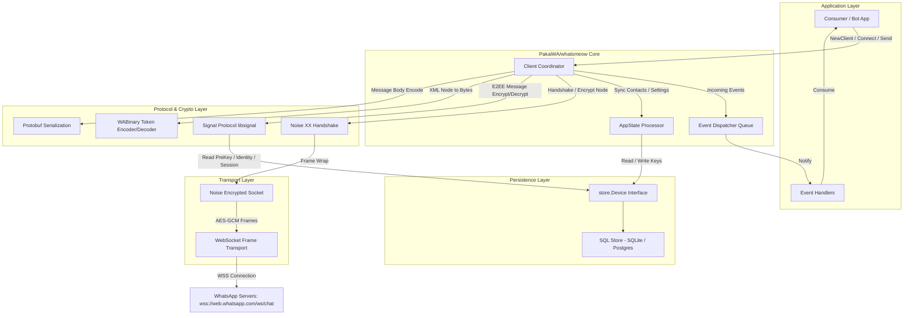

# Technical Architecture

## 1. Component Architecture

WhatsApp Web Multi-device Client Architecture:



---

## 2. Request & Data Flow

### 2.1 Ingress / Message Reception Lifecycle
```text
[WhatsApp WebSocket]
        │
        ▼ (Raw WebSocket Frame)
[socket.FrameSocket]
        │
        ▼ (AES-GCM Decrypted Frame)
[socket.NoiseSocket]
        │
        ▼ (Binary Payload)
[binary.Unpack / binary.NewDecoder]
        │
        ▼ (waBinary.Node XML Tree)
[whatsmeow.Client.handleFrame]
        │
        ├── IQ Response Matching (cli.responseWaiters)
        ├── Incoming Message Node (<message ...>)
        │       │
        │       ▼
        │   [libsignal / SignalProtocol.Decrypt]
        │       │
        │       ▼
        │   [proto.Unmarshal -> waE2E.Message]
        │       │
        │       ▼
        │   [Dispatch Event: events.Message]
        │       │
        │       ▼
        │   [Registered EventHandler(s)]
        │
        └── Notification / Receipt Node (<notification>, <receipt>)
                │
                ▼
            [Parse & Dispatch Event]
```

### 2.2 Egress / Sending Message Lifecycle
```text
[Consumer: client.SendMessage(ctx, jid, msg)]
        │
        ▼
[Resolve Target Device(s) & JIDs via Client Cache / Server Query]
        │
        ▼
[libsignal Encrypt: Session Cipher (1-on-1) or SenderKey (Group)]
        │
        ▼
[Construct waBinary.Node ("action" -> "enc" payload with IV & Ciphertext)]
        │
        ▼
[binary.Marshal (Tokenized Binary XML)]
        │
        ▼
[socket.NoiseSocket.SendFrame (AES-GCM Encryption with Incrementing Counter)]
        │
        ▼
[socket.FrameSocket (3-byte length prefix framing)]
        │
        ▼
[coder/websocket Transport -> WhatsApp Gateway Server]
```

---

## 3. Concurrency & Resource Management

- **Goroutine & Channel Synchronization**:
  - `socket.FrameSocket`: Membaca websocket dalam goroutine terisolasi (`readFrames`) dan menyalurkannya via unbuffered/buffered channels.
  - `socket.NoiseSocket`: Menjalankan consumer loop terpisah (`consumeFrames`) yang berhenti secara bersih saat context dibatalkan.
  - `Client.handlerQueue`: Setiap koneksi membuat channel antrean node berkapasitas (`handlerQueueSize = 2048`) untuk memproses pesan masuk secara serial per koneksi, mencegah race condition parsing state.
  - `responseWaiters`: Menggunakan `map[string]chan<- *waBinary.Node` yang diproteksi `sync.Mutex` untuk mencocokkan request-response IQ queries secara non-blocking.
- **Locking & Mutex**:
  - `socketLock sync.RWMutex`: Melindungi lifecycle pointer socket selama reconnect / disconnect.
  - `mediaConnLock`, `appStateSyncLock`, `uploadPreKeysLock`: Menghindari overlapping mutasi pre-key atau permintaan credentials media server.
- **Context Propagation**:
  - Semua operasi I/O publik (`Connect`, `SendMessage`, `Download`, `GetUserInfo`) menerima `context.Context` untuk mendukung timeout, deadline, dan graceful cancellation.

---

## 4. Error Handling & Fault Tolerance

- **Auto-Reconnection**:
  - Mendukung `EnableAutoReconnect` otomatis dengan exponential backoff dan `AutoReconnectHook` kustom.
  - State machine membedakan graceful disconnect (`Disconnect()`) vs network drop tak terduga.
- **Decryption Retry Mechanism (`retry.go`)**:
  - Jika pesan gagal didekripsi karena session out-of-sync atau key hilang, client otomatis mengirimkan permintaan retry (`<retry ...>`) ke pengirim dengan prekey baru.
- **Sentinel Errors & Validation**:
  - Memiliki sentinel error terdefinisi di `errors.go` (misal: `ErrNotConnected`, `ErrAlreadyConnected`, `ErrIQTimedOut`).

---

## 5. Observability & Telemetry

- **Pluggable Logging Interface (`util/log`)**:
  - Menggunakan interface `waLog.Logger` (`Debugf`, `Infof`, `Warnf`, `Errorf`).
  - Menyediakan adapter siap pakai untuk `stdout` dan `zerolog` (`util/log/zerolog.go`).
  - Logging level terpisah antara level client umum, incoming frames (`recvLog`), outgoing frames (`sendLog`), dan database query execution.

---

## 6. Data & Domain Boundaries

- **JID Types (`types.JID`)**:
  - Menangani isolasi ketat antara nomor telepon biasa (`types.DefaultUserServer` = `@s.whatsapp.net`), privasi LID (`types.HiddenUserServer` = `@lid`), grup (`types.GroupServer` = `@g.us`), dan channel (`types.NewsletterServer` = `@newsletter`).
- **Store Separation**:
  - Persistence terisolasi penuh di package `store/`. Logic protokol client tidak pernah memanggil raw SQL langsung, melainkan melalui interface `store.Device` dan `store.DeviceContainer`.
